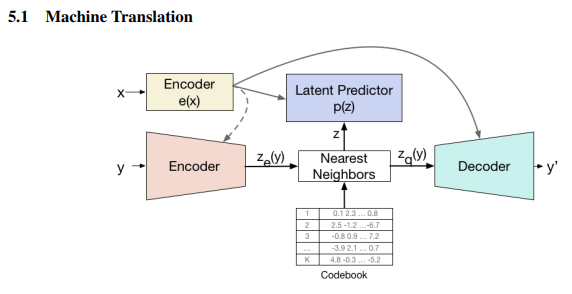
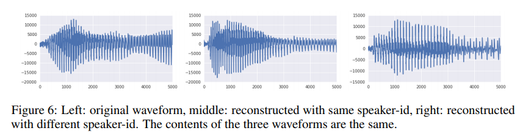

# summary of "**Neural Discrete Representation Learning"**

van den Oord, Aaron, and Oriol Vinyals. "Neural discrete representation learning." Advances in Neural Information Processing Systems. 2017.

[https://arxiv.org/pdf/1711.00937.pdf](https://arxiv.org/pdf/1711.00937.pdf)

# Author's Blog Article:

[https://avdnoord.github.io/homepage/vqvae/](https://avdnoord.github.io/homepage/vqvae/)

# TL;DR:

- modification of variational autoencoders (VAEs)
- method of encoding *discrete* latent variables based on vector quantization (VQ)
- prevents "posterior collapse" in which latents are ignored when decoder is autoregressive

# Terms:

## autoregressive model

a type of time series model in which previous data is used to predict future elements. 

= Markov model.

see: [https://www.statisticshowto.datasciencecentral.com/autoregressive-model/](https://www.statisticshowto.datasciencecentral.com/autoregressive-model/)

## **variational autoencoders**

a type of encoder-decoder autoencoder in which the encoder is trained to output the *parameters of a distribution* `Q(z|x)`, such that sampling a *`z`* from this distribution maximizes the probability that vector *`z`* contains the information in input *`x`.* This *`z`* is used to reconstitute the input *`x`*. 

This is done by adding a *KL divergence* penalty to the loss function, along with the typical reconstruction (cross-entropy) loss; the reconstruction loss ensures that the output resembles the input ("clustering" similar inputs in the latent space), while the KL divergence term ensures the distribution of the latent features resembles a Gaussian distribution ("spreading out" the latents in the possible space).

By sampling directly from the distribution, new samples can be generated.

see: [https://towardsdatascience.com/intuitively-understanding-variational-autoencoders](https://towardsdatascience.com/intuitively-understanding-variational-autoencoders-1bfe67eb5daf)

see: [http://anotherdatum.com/vae.html](http://anotherdatum.com/vae.html)

see: [https://jaan.io/what-is-variational-autoencoder-vae-tutorial/](https://jaan.io/what-is-variational-autoencoder-vae-tutorial/)

## vector quantization

a type of quantization where a probability function is modeled using a number of prototype "quantization vectors" in a "code book". at its most basic, the training consists of iterations of: 1) pick a sample point at random 2) find the closest quantization vector 3) move this vector fractionally closer to the sample. this is an effective lossy encoding method.

# Model:

- define latent embedding space *`e*∈ ℝ^(K*D)` where *`K`* is number of quantization vectors and *`D`* is the dimension if each vector `*e_i*`.
- encoder: `x` > `z_e(x)`
- discrete latent variables `z` calculated by nearest neighbor in embedding space `e`
eqn 1: `q(z=k|x) = {1 for k = argmin_j||z_e(x)-e_j||_2, 0 otherwise}`
(can be viewed as "nonlinearity" that maps latents to 1-of-K embeddings)
- the input to decoder is corresponding embedding vector `e_k`:
eqn 2: `z_q(x) = e_k, where k = argmin_j||z_e(x)-e_j||_2`
- eqn 2 has no real gradient, so approximate by copying gradients from decoder input `z_q(x)` back to encoder output `z_e(x)` (alternative: use subgradient through quantization op)
- for audio decoding, use WaveNet as autoregressive distribution `p(z)` over `z` to get `x` output.

# Experiments & Results:

## audio (including speaker style transfer)

- **test 1**:
    - data: VCTK dataset
    - dilated convnet architecture (WaveNet)
    - 6 strided convolutions with stride 2 and window 4 == latent size 64x smaller
    - discrete space is 512 dimensions
    - decoder is conditioned on latents *and* one-hot speaker embedding
- **test 2:**
    - much bigger model with more speakers
- **results:**
    - allows for reconstruction of audio, although while content is preserved, waveform and prosody is different, signifying that the latent space preserves high-level features
    - changing speaker ID allows speaker conversion; means latents are modeling an underlying representation of the speech content independent (largely) of speaker voice information.
    - using the 128 latent features for prediction of the 41 phoneme values (not used in training) results in correct responses at rate 7x greater than random chance, indicating that the model learns latent codes that are similar to linguistic phoneme values.

