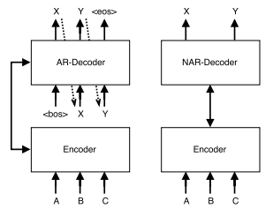
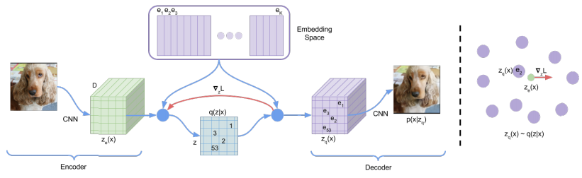

# summary of "Theory and Experiments on Vector Quantized Autoencoders"

Roy, Aurko, et al. "Theory and experiments on vector quantized autoencoders." arXiv preprint arXiv:1805.11063 (2018).

[https://arxiv.org/pdf/1805.11063.pdf](https://arxiv.org/pdf/1805.11063.pdf)

# Contributions:

- VQ-VAE can outperform SOTA without product quantization
- new EM-based training algorithm
- non-autoregressive NMT model that almost meets autoregressive models while being faster at inference

# Terms:

## expectation maximization (EM)

iterative algorithm that finds maximum likelihood estimate for model parameters in cases of incomplete/missing data or latent variables.

K-means can be seen as EM type algorithm for Gaussian mixture model with identity covariance ("round" clusters) and uniform prior over cluster probabilities

outline of "hard" or viterbi EM for Gaussian mixture models (GMM):

- assume data is made from number of Gaussian distributions
- estimate `K` number of distributions in mixture (from domain knowledge, data viz, or randomly)
- estimate initial parameters (mean and variance) of each distribution
- until converged:
    - **E-Step**: assign each data point to a class based on prediction from current parameters
    = cluster all the data according to current estimated distributions
    ("hard" EM: assign to class with highest probability)
    - **M-Step**: update distributional parameter estimates based on new data assignments
    = update (maximize) distribution parameters based on data clusters

see: [https://www.cs.utah.edu/~piyush/teaching/EM_algorithm.pdf](https://www.cs.utah.edu/~piyush/teaching/EM_algorithm.pdf)

see: [https://www.kdnuggets.com/2016/08/tutorial-expectation-maximization-algorithm.html](https://www.kdnuggets.com/2016/08/tutorial-expectation-maximization-algorithm.html)

see: [https://www.statisticshowto.datasciencecentral.com/em-algorithm-expectation-maximization/](https://www.statisticshowto.datasciencecentral.com/em-algorithm-expectation-maximization/)

## exponentially moving average (EMA)

a moving average that weights recent changes higher, generally:
`ema_t = (1 - k) * last_value + k * ema_t-1` 

one approach to training latent vectors in VQ-VAE uses EMA-based rather than gradient-based update of latent vectors `e_j`  by keeping EMA averages of embeddings `e_j` and counts `c_j` for number of encoder hidden states that are nearest neighbors to `e_j`

see: [https://www.investopedia.com/terms/e/ema.asp](https://www.investopedia.com/ask/answers/122314/what-exponential-moving-average-ema-formula-and-how-ema-calculated.asp)

## knowledge distillation

from the nervana link (worth reading):

"Knowledge distillation is model compression method in which a small model is trained to mimic a pre-trained, larger model (or ensemble of models). This training setting is sometimes referred to as "teacher-student", where the large model is the teacher and the small model is the student... knowledge is transferred from the teacher model to the student by minimizing a loss function in which the target is the distribution of class probabilities predicted by the teacher model. That is, the output of a softmax function on the teacher model's logits... Hinton et al., 2015 introduced the concept of *softmax temperature*." - nervanasystems

see: [https://nervanasystems.github.io/distiller/knowledge_distillation.html](https://nervanasystems.github.io/distiller/knowledge_distillation.html)

see: [https://arxiv.org/abs/1902.03393](https://arxiv.org/abs/1902.03393)

## non-autoregressive transformer (NAT)

a type of transformer that is not conditioned on previous generated outputs (operates in parallel)

see:

Gu, J., Bradbury, J., Xiong, C., Li, V. O., & Socher, R. (2017). Non-autoregressive neural machine translation. arXiv preprint arXiv:1711.02281. 

[https://arxiv.org/abs/1711.02281](https://arxiv.org/abs/1711.02281)

Figure 1: Translating “A B C” to “X Y” using autoregressive and non-autoregressive neural MT architectures. The latter generates all output tokens in parallel.

## product quantization

from Kaiming He link:

"Product quantization (PQ) is an effective vector quantization method. A product quantizer can generate an exponentially large codebook at very low memory/time cost. The essence of PQ is to decompose the high-dimensional vector space into the Cartesian product of subspaces and then quantize these subspaces separately."

see: [http://kaiminghe.com/cvpr13/index.html](http://kaiminghe.com/cvpr13/index.html)

see: [https://lear.inrialpes.fr/pubs/2011/JDS11/jegou_searching_with_quantization.pdf](https://lear.inrialpes.fr/pubs/2011/JDS11/jegou_searching_with_quantization.pdf)

# Model:

- VQ-VAE
- EM for updating vectors:
    - encoder output `z_e(x)` corresponds to a data point
    - discrete latent variables correspond to clusters
    - the discrete latent variable assignment to `z` corresponds to the E-step
    - the quantization vector update (e.g. with EMA) corresponds to the M-step update
    - "soft" EM: the data point is assigned to mixture of clusters
    - Monte Carlo EM
    - EMA update during M-step
- embedding sent to decoder is (unweighted) average of embeddings of sampled latents
- during backward pass, all sampled embeddings are updated
- **images:**
    - unconditional VQ-VAE, trained on CIFAR-10 dataset
- **translation:**
    - model `P(y, z|x)` where `x` is source and `y` is target sentence
    - source sentence `x` is encoded with number of causal self-attention layers
    - `y` is encoded in series of strided convolutions with residual convnets in between
    - decoder is transposed convolutional network into a transformer with causal attention

# Experiments & Results:

## images

EM-based VQ-VAE model gets better NLL than baseline VQ-VAE

## translation

translation achieves higher BLEU and faster inference than previous VQ-VAE approach, with smaller codebook, on WMT'14 English-German test.

sequence-level distillation during training further increases performance of model, using transformer teacher model.

each compression step of the encoder, the sequence length is halved (`n_c=2`). using `n_c=4`, the VAE model outperforms a similar Non-Autoregressive Transformer (NAT) model in both BLEU score and decoding time.

tuning code book size can increase performance

soft EM led to more robustness to hyperparameters in comparison to hard EM